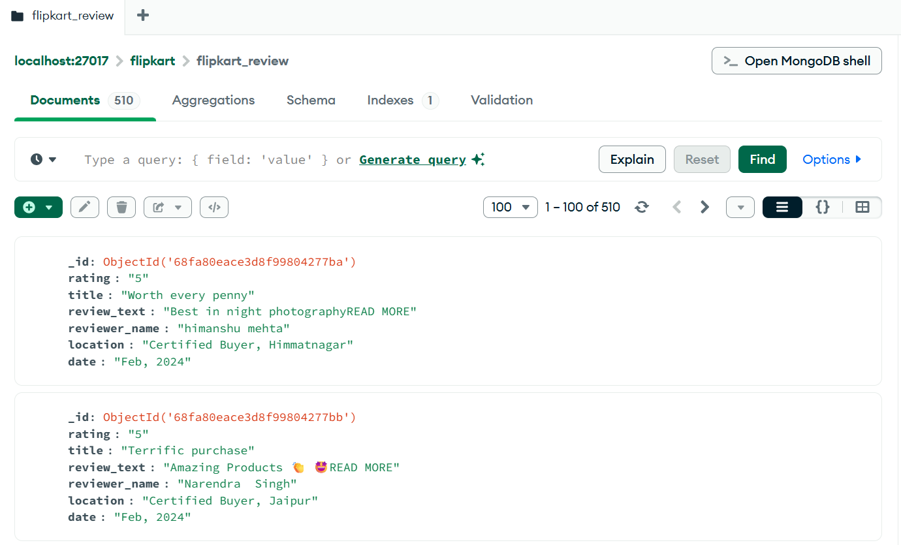

🛒 E-Commerce Reviews ETL Pipeline (MongoDB + MySQL)

---

📌 Project Overview
-------------------
This project demonstrates a **complete end-to-end ETL (Extract, Transform, Load) pipeline** using real-world e-commerce review data from **Flipkart**.

The pipeline extracts unstructured product reviews from Flipkart, stores the raw data in **MongoDB**, performs text cleaning and transformations using **Python and NLP techniques**, and loads the curated, analytics-ready data into **MySQL** for downstream analysis.

This project reflects **real-world data engineering practices**, including handling unstructured data, NoSQL to SQL migration, data preprocessing, and schema design for analytics.

---

🎯 Project Objective
-------------------
To build a **reliable and scalable ETL pipeline** that:

- Ingests unstructured review data from an e-commerce platform  
- Stores raw data efficiently using MongoDB  
- Cleans and preprocesses textual data  
- Applies transformations for analytics readiness  
- Loads curated data into a relational database (MySQL)  

---

🔄 ETL Pipeline Flow
-------------------
1️⃣ **Extract**  
- Scrape Flipkart product reviews using Python and BeautifulSoup  

2️⃣ **Load (Raw Data)**  
- Store extracted reviews in MongoDB for flexible schema handling  

3️⃣ **Transform**  
- Clean review text (lowercasing, stopword removal, punctuation removal)  
- Remove unwanted text such as “READ MORE”  
- Split buyer status and location into separate fields  
- Generate processed date values  

4️⃣ **Load (Curated Data)**  
- Load transformed data into MySQL using SQLAlchemy  

---

🧰 Technologies Used
-------------------
- 🐍 Python  
- 🌐 BeautifulSoup  
- 🍃 MongoDB  
- 🧮 Pandas  
- 🧠 NLTK  
- 🐬 MySQL  
- 🔗 SQLAlchemy  

---

📁 Project Structure
-------------------
ecommerce-review-etl/
├── src/
│ ├── flipkart_reviews_to_mongodb.py
│ └── transform_mongo_to_mysql.py
├── outputs/
│ └── flip_review_sample.csv
├── docs/
│ └── screenshots/
│ └── mongodb_flipkart_collection.png
├── requirements.txt
├── .gitignore
└── README.md


---

🗄️ MongoDB Output
-------------------
Below is a sample screenshot showing Flipkart product reviews successfully stored in MongoDB after extraction:



---

🧪 Data Transformations
-------------------
The following transformations are applied to the raw review data:

- Convert review text to lowercase  
- Remove “READ MORE” text and punctuation  
- Remove stopwords and emoticons  
- Tokenize and clean textual data  
- Split buyer status and location into separate columns  
- Generate processed date values  
- Drop unused raw columns  


-------------------

### 1️⃣ Install Dependencies
```bash
pip install -r requirements.txt
2️⃣ Run Extraction and MongoDB Load
python src/flipkart_reviews_to_mongodb.py
3️⃣ Run Transformation and MySQL Load
python src/transform_mongo_to_mysql.py
📤 Output
Raw review data stored in MongoDB

Cleaned and transformed review data stored in MySQL

Sample CSV output for validation

📝 Notes
Only sample output files are included in this repository

MongoDB runs locally on localhost:27017

MySQL credentials should be updated based on local configuration

🚀 Future Enhancements
Perform sentiment analysis on review text

Automate the pipeline using Apache Airflow

Containerize the pipeline using Docker

Build dashboards using SQL-based analytics
